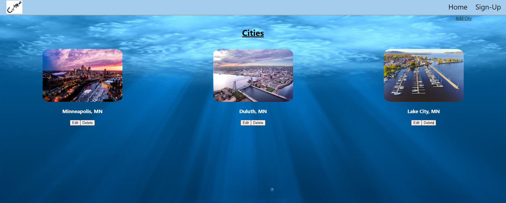

# Fisher Finder
### By Mohamed Osman
&nbsp; 

[Heroku!](https://git.heroku.com/fisherfinder.git)
## Introduction:
I will be making a fishing app to find local fishing spots. The locations will be user inputted and stored in a database. From within the App you will be able to add, delete, and edit cities and locations.

## Requirements:
Have a separate directory for the frontend (client) and have your backend within the main repository.

Utilize flexbox or grid 

Include a minimum of 2 Mongoose Schemas 

Have Full CRUD (CREATE, READ, UPDATE, DELETE) operations

Display data from each model on the frontend 

Must be able to navigate between different pages (React Router)

Have at least 40 meaningful git commits. You should be committing your changes every time you build a new feature.

Your code should be properly indented, spaced, and within code blocks.

&nbsp;  

## Diagrams:

## Screenshots: 

